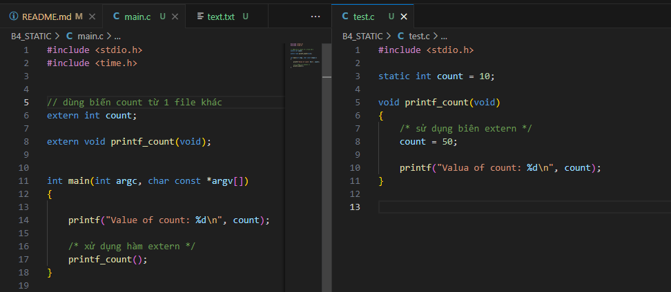

# ADVANCE C/C++ ALGORITHM (HalaAcademy)

## BÀI 1: COMPILER VÀ CÁC CHỈ THỊ TIỀN XỬ LÝ

### 1. QUÁ TRÌNH BIÊN DỊCH (COMPILER)

**Compiler** là một quá trình máy tính chuyển đổi mã nguồn được viết bằng một ngôn ngữ lập trình (như C, C++,...) thành mã máy (machine code) mà máy tính có thể hiểu và thực thi.

**BAO GỒM 4 BƯỚC:**

#### Bước 1: Tiền xử lý (Preprocessing)
+ Copy tất cả nội dung trong các file được #include
+ Thay thế các Macro # 
+ Lược bỏ chú thích  //, /**/
Sau quá trình này file `source.c -> source.i`
Ta có 2 file `main.c` và `hello.c`
 

Sau khi thực hiện lệnh `gcc -E hello.c -o hello.i` và `gcc -E main.c -o main.i`
Ta đc 2 file `main.i` và `hello.i`
  

#### Bước 2: Compilation
+ Trình biên dịch chuyển mã nguồn thành mã assembly.
Sau quá trình này file `source.i -> source.s`

Thực hiện lệnh `gcc -S main.i -o main.s` và `gcc -S hello.i -o hello.s`
  

#### Bước 3: Assemble
+ Trình biên dịch chuyển từ mã máy thành mã nhị phân.
Sau quá trình này file `source.s -> source.o`

Thực hiện lệnh `gcc -c main.s -o main.o` và `gcc -c hello.s -o hello.o`
  

#### Bước 4: Linking
+ Liên kết các module và các thư viện liên kết thành file thực thi.
+ Hợp các file nguồn, file thư viện thành 1 file thực thi duy nhất `source.exe`
  
Thực hiện lệnh `gcc main.o hello.o -o main` để hợp nhất thành 1 file thực thi `main.exe` 
  
+ Chạy file thực thi 

        PS C:\Users\Huy Le\Documents\HALAacedemy\Code\CodeC_Advance\B1> gcc main.o hello.o -o main
        PS C:\Users\Huy Le\Documents\HALAacedemy\Code\CodeC_Advance\B1> ./main
        hello everyone
        function 1

### 2. CÁC CHỈ THỊ TIỀN XỬ LÝ

#### - Chỉ thị bao hàm tệp (#include)
Chỉ thị `#include` cho phép gộp file khác vào file chúng ta đang viết
ví dụ:
 

Sau quá trình tiền xử lý:
 

Ta có thể thấy toàn bộ nội dung file `hello.h` đã được copy vào `main.c`
#### - Chỉ thị định nghĩa cho tên (#define macro)  

**Marco** là một cách để định nghĩa lại một giá trị hay một chuỗi các lệnh nhằm tránh lặp lại mã và có thể làm cho chương trình dễ bảo trì hơn. 
**Marco** được định nghĩa bằng chỉ thị `#define` 

`#define PI 3.14`   
`#define MAX(a, b) ((a) > (b) ? (a) : (b))`     

**Variadic Macro** (macro biến số) là loại macro trong C có thể nhận một số lượng tham số không xác định. Chúng cho phép định nghĩa các macro có thể xử lý nhiều tham số hơn so với macro thông thường.
Cú pháp: 
#define DISPLAY(...)   ____VA_ARGS____
Trong đó:
+ `...`: Đại diện cho các tham số biến đổi
+ __VA_ARGS__: Đại diện cho các tham số biến đổi trong phần thân của macro.

Ví dụ:
Bài toán tính tổng của 1 dãy số:

Ở file main.c

    #include "stdio.h"
    #define tong(...)  \
    int array[] = {__VA_ARGS__, -1};\         // __VA_ARGS__ = ...
    int i = 0;                      \
    int sum = 0;                    \
    while(array[i] != -1)           \
    {                               \
        sum = sum + array[i];       \
        i ++;                       \
    }                               \
    printf("tong = %d\n", sum);

    int main()
    {
        tong(4,5,7,9,11);                   // __VA_ARGS__ = 4,5,7,9,11
        
        return 0;
    }

Ở file main.i

    int main()
    {
        int array[] = {4,5,7,9,11, -1};      // __VA_ARGS__ đã được thay vào 
        int i = 0;
        int sum = 0;
        while(array[i] != -1)
        { 
        sum = sum + array[i]; 
        i ++; 
        } 
        printf("tong = %d\n", sum);;

        return 0;
    }

Một số ứng dụng của **Variadic Macro**: 

+ **Log messages**: Viết các macro để ghi lại thông báo log với định dạng tùy ý.
`#define LOG(format, ...) fprintf(stderr, format, __VA_ARGS__)`
+ **Debugging**: Thêm thông tin như tên hàm, file nguồn, hoặc dòng số vào thông báo debug.
`#define DEBUG(format, ...) fprintf(stderr, "[DEBUG] %s:%d: " format, __FILE__, __LINE__, __VA_ARGS__)`
## BÀI 2: STDARG - ASSERT
### 1.Thư viện #include <stdarg.h> 
Variadic functions (hàm biến số tham số) là các hàm trong C có thể nhận một số lượng tham số không xác định. Điều này khác với các hàm thông thường, nơi số lượng tham số được xác định tại thời điểm khai báo hàm
Cách sử dụng:
+ Khai báo hàm: `int sum(int count, ...)` cho phép hàm nhận một số lượng tham số biến đổi sau tham số cố định count.
+ Macro `va_list`: Được sử dụng để khai báo một biến có thể truy cập các tham số nhập vào.
+ Macro `va_start`: Được sử dụng để khởi tạo danh sách các tham số biến đổi. Nó nhận vào hai tham số: danh sách args và tên của label làm mốc. Ví dụ ở đây là label `count`
+ Macro `va_arg`: Được sử dụng để truy xuất từng tham số biến đổi từ danh sách args. Mỗi lần gọi va_arg, bạn nhận được giá trị của tham số tiếp theo với kiểu dữ liệu được chỉ định ví dụ ở đây là `int`.
+ Macro `va_end`: Được sử dụng để kết thúc việc truy cập danh sách các tham số biến đổi.

Một số ứng dụng của **Variadic Function**: 
**Tạo các hàm xử lý nhiều tham số** 

Bài tập: tính tổng của 1 dãy số.

    #define tong(...)   sum(__VA_ARGS__, 0)    /*giá trị 0 là dấu hiệu kết thúc*/
    int sum(int count,...) 
    {
        va_list va;      /*khai báo 1 biến để truy cập tham số nhập vào*/
        int sum = count; 

        va_start(va, count);   /*khởi tạo danh sách tham số bắt đầu từ label count*/
        int value;

        while ((value = va_arg(va, int)) != 0)  /*lấy giá trị và kiểm tra */
        {
            sum += value;
        }

        va_end(va);                            /*kết thúc*/

        return sum;
        
    }

    int main()
    {
        printf("Tong: %d\n", tong(6, 1,4, 5,9,6,4));

        return 0;
    }

Kết quả: 
`Tong: 35`

+**Xây dựng hàm để xử lý dữ liệu** 

Bài tập: viết hàm xử lý 2 hay nhiều cảm biến:

    #include <stdio.h>
    #include <stdarg.h>

    typedef enum{
        TEMPERATURE_SENSOR,
        PRESSURE_SENSOR
    }SensorType;

    void processSensorData(SensorType type, ...)
    {
        va_list args;               /*khai báo 1 biến để truy cập tham số nhập vào*/
        va_start(args, type);      // xác định lable để lấy dữ liệu 
        switch (type)
        {
            case TEMPERATURE_SENSOR:
            {
                int numArgs = va_arg(args, int);            // lấy dữ liệu 1 ép kiểu int 
                int sensorId = va_arg(args, int);           // lấy dữ liệu 2 ép kiểu int
                float temperature = va_arg(args, double);   // lấy dữ liệu 3 ép kiểu double 

                
                printf("Temperature Sensor ID: %d, Reading: %.2f degrees\n", sensorId, temperature);
                if(numArgs > 2)
                {
                    // xử lí thêm tham số nếu có 
                    char* additionalInfo = va_arg(args, char*);  // lấy dữ liệu 4 ép kiểu char* 
                    printf("Additional Info:%s\n", additionalInfo); 
                }
                break;
            }
            case PRESSURE_SENSOR: 
            {
                int numArgs = va_arg(args, int);
                int sensorId = va_arg(args, int);
                int pressure = va_arg(args, int);
                printf("Pressure Sensor ID: %d, Reading: %d Pa\n", sensorId, pressure);
                if(numArgs > 2)
                {
                    // Xử lý thêm tham số nếu có
                    char* unit = va_arg(args, char*);
                    printf("Unit: %s\n", unit);
                }
                break;
            }     

            default:
                break;
        }

        va_end(args);                
    }

    int main()
    {
        processSensorData(TEMPERATURE_SENSOR, 3, 1, 36.5, "Room Temperature");
        processSensorData(PRESSURE_SENSOR, 3, 2, 101325);    
        return 0;
    }
Kết quả:

    Temperature Sensor ID: 1, Reading: 36.50 degrees
    Additional Info:Room Temperature
    Pressure Sensor ID: 2, Reading: 101325 Pa
    Unit: Room Temperature

## BÀI 3: CON TRỎ (POINTER)

### 1. Con trỏ
**Con trỏ** là một biến mà trong đó giá trị của nó là địa chỉ của một biến khác.
**Cách sử dụng con trỏ:**
- *Khai báo con trỏ*: `type *pointer_name;`
- *Gán địa chỉ cho con trỏ*: sử dụng toán tử `&` ví dụ:
    `int a = 10;`
    `int *ptr = &a;  // khai báo và gán giá trị địa chỉ biến a cho con trỏ ptr`
- *Truy cập giá trị thông qua con trỏ*: sử dụng toán tử `*` ví dụ: 
    `*ptr = 20 // thay đổi giá trị của địa chỉ mà ptr đang trỏ tới = 20`    

Ví dụ: 

    int a = 10;
    int *ptr = &a;  // khai báo và gán giá trị địa chỉ biến a cho con trỏ ptr

    printf("dia chi cua bien a: %p\n", &a);             // in ra địa chỉ biến a
    printf("gia tri cua con tro ptr: %p\n", ptr);       // in ra giá trị của ptr

    printf("gia tri cua bien a: %d\n", a);              // in ra giá trị của biến a
    printf("gia tri tai dia chi ptr tro den: %d\n", *ptr);     // in ra giá trị tại địa chỉ ptr trở đến
Kết quả in ra Terminal: 

    dia chi cua bien a:      000000048FFFFDD4
    gia tri cua con tro ptr: 000000048FFFFDD4
    gia tri cua bien a: 10
    gia tri tai dia chi ptr tro den: 10

**Con trỏ void**:
+ Là 1 con trỏ có thể trỏ đến bất kì kiểu dữ liệu nào. 
+ Phải thực hiện ép kiểu con trỏ `void` trước khi truy suất giá trị. Do con trỏ `void` không có kiểu dữ liệu cụ thể nên trình biên dịch không biết cần đọc bao nhiêu byte.

ví dụ:

    #include "stdio.h"

    int main()
    {
        int a = 10;
        void *p = NULL;                  // khai báo con trỏ NULL
        p = &a;                          // gán địa chỉ biến a cho p;
        printf("*p = %d \n", *(int*)p);  // ép thành kiểu int* để truy suất giá trị

        return 0;
    }

Kết quả:

    *p = 10 

**Hằng con trỏ (Pointer to Constant)**: 
`Pointer to Constant` là được sử dụng khi thiết kế các hàm cho phép người dùng chỉ đọc chứ không được phép ghi. 
+ Cú pháp: `const type *pointer_name;`  Ví dụ: `const char *str1`
+ Không thể thay đổi giá trị tại địa chỉ mà con trỏ trỏ tới.
+ Có thể thay đổi đại chỉ mà con trỏ trỏ tới.
Ví dụ: 
Bài toán sắp xếp sinh viên. 
Có 1 số các hàm tạo ra chỉ để đọc dữ liệu và xử lí. Ta sử dụng const để ngăn chặn việc thay đổi giá trị. 

        int stringCompare(const char *str1, const char * str2)  // khai báo kiểu const
        {
            while (*str1 && (*str1 == *str2))           // đọc giá trị 
            {
                str1 ++;
                str2 ++;
            }
            /*đọc giá trị*/
            return *(const unsigned char*) str1 - *(const unsigned char*) str2;
        }
        /*Truyền vào hàm */
        int compareByName(const void *a, const void *b)
        {
            /*Ép về kiểu SinhVien để truy suất giá trị*/
            SinhVien *sv1 = (SinhVien *)a;
            SinhVien *sv2 = (SinhVien *)b;

            /*Đọc giá trị*/
            return stringCompare(sv1 -> ten, sv2 -> ten);
        }
        
        int compareByDiemTrungBinh(const void *a, const void *b)
        {
            /*Ép về kiểu SinhVien để truy suất giá trị*/
            SinhVien *sv1 = (SinhVien *)a;
            SinhVien *sv2 = (SinhVien *)b;

            /*Đọc giá trị*/
            if(sv1 -> diemTrungBinh > sv2->diemTrungBinh)
            {
                return 1;
            }
            return 0;
        }

**Con trỏ hằng (Constant Pointer)**: 
`Con trỏ hằng (constant pointer)` là một con trỏ mà giá trị của chính con trỏ đó (tức là địa chỉ mà nó trỏ tới) không thể thay đổi sau khi được khởi tạo. Nói cách khác, một khi đã gán một địa chỉ cụ thể cho con trỏ hằng, thì không thể làm cho nó trỏ tới một địa chỉ khác. Tuy nhiên, vẫn có thể thay đổi giá trị tại địa chỉ mà con trỏ hằng trỏ tới.
+ Cú pháp: `type *const pointer_name;`  Ví dụ: `char *const str1`

Ứng dụng:

Trong lập trình vi điều khiển. Để đảm bảo rằng các con trỏ truy cập các thanh ghi này không bị thay đổi địa chỉ trong quá trình thực thi, con trỏ hằng có thể được sử dụng.

`unsigned int * const PORTA = (unsigned int *)0x40004000;`

Giá trị của con trỏ PORTA được gán = `0x40004000`

Một ví dụ khác về con trỏ hằng:

    #include <stdio.h>

    int main() {
        int x = 10;
        int *const ptr = &x;  // Con trỏ hằng trỏ đến x

        *ptr = 20;  // Hợp lệ: thay đổi giá trị của x thông qua con trỏ hằng
        printf("x = %d\n", x);  // In ra 20

        int y = 30;
        // ptr = &y;  // Lỗi: không thể thay đổi địa chỉ mà con trỏ hằng trỏ tới

        return 0;
    }

### 2. Con trỏ hàm
**Con trỏ hàm** được dùng để lưu trữ địa chỉ của một hàm. Điều này cho phép gọi hàm thông qua con trỏ, điều này hữu ích trong các trường hợp như truyền hàm làm đối số cho các hàm khác. 
**Cách sử dụng con trỏ hàm:**
- *Khai báo con trỏ hàm*: `return_type (*pointer_name)(parameter_types);`
  ví dụ: `int (*pFunc)(int, int);`
- Gán địa chỉ hàm cho con trỏ:
  
  ví dụ: 

        int add(int a, int b) 
        {
            return a + b;
        }
        pFunc = add;
- Gọi hàm thông qua con trỏ:
    `int result = pFunc(5, 3); // Kết quả là 8`

ví dụ:

    #include <stdio.h>
    int add(int a, int b)
    {
        return a + b;
    }

    int main()
    {
        int (*ptr)(int,int);

        ptr = add;
        int sum = ptr(3,5);
        printf("sum = %d\n", sum);     // in ra giá trị tại địa chỉ ptr trở đến

        return 0;
    }

Kết quả:
 `sum = 8`

Ứng dụng của con trỏ hàm:
Trong bài toán tổng, hiệu, thương, tích:

    #include "stdio.h"
    #include <assert.h>

    void tong(int a, int b)
    {
        printf("Tong %d va %d: %d\n", a, b, a + b);
    }

    void hieu(int a, int b)
    {
        printf("Hieu %d va %d: %d\n", a, b, a - b);
    }

    void tich(int a, int b)
    {
        printf("Tich %d va %d: %d\n", a, b, a * b);
    }

    void thuong(int a, int b)
    {
        assert(b != 0);
        printf("Thuong %d va %d: %d\n", a, b, a / b);
    }

    /* Viết 1 hàm tính toán chung*/
    /* Với các tham số truyền vào
    + void (*ptr) (int, int): Địa chỉ của hàm thực hiện
    + int a: số hạng thứ nhất
    + int b: số hạng thứ hai
     */
    void tinhToan (void (*ptr) (int, int), int a, int b)
    {
        printf("Thuc hien phep toan duoi:\n");
        /* sử dụng con trỏ hàm để gọi tới các hàm tương ứng */
        ptr(a,b);
    }

    int main()
    {
        tinhToan(&tong, 4, 5);
        tinhToan(&hieu, 7, 5);
        tinhToan(&tich, 4, 5);
        tinhToan(&thuong, 10, 5);
        return 0;
    }

Kết quả:

    Thuc hien phep toan duoi:
    Tong 4 va 5: 9
    Thuc hien phep toan duoi:
    Hieu 7 va 5: 2
    Thuc hien phep toan duoi:
    Tich 4 va 5: 20
    Thuc hien phep toan duoi:
    Thuong 10 va 5: 2

## BÀI 4: Extern - Static - Volatile - Register
### 1. Extern

Trong ngôn ngữ lập trình C, từ khóa `extern` được sử dụng để khai báo một biến hoặc hàm đã được định nghĩa ở nơi khác, có thể là trong một file khác hoặc ở một vị trí khác trong cùng file. Từ khóa này được dùng để thông báo cho trình biên dịch rằng biến hoặc hàm này tồn tại, nhưng nó sẽ không được định nghĩa tại vị trí này.

Ví dụ:

 

Kết quả in ra terminal: 

Ở file `test.c` ta có 1 biến `count` và 1 hàm void `prinf_count(void)`

Ở file `main.c` không cần #include file mà chỉ cần dùng từ khóa `extern`. Sau đó ta có thể sử dụng chúng.

    Value of count: 10
    Valua of count: 50

### 2. Static
#### Biến static cục bộ
Thông thường, các biến cục bộ chỉ tồn tại trong thời gian hàm được gọi và sẽ bị hủy sau khi hàm kết thúc. Tuy nhiên, `biến static cục bộ` vẫn tồn tại trong suốt thời gian chương trình chạy.
**Đặc điểm**:
+ Chỉ khởi tạo 1 lần duy nhất. Lần thứ 2 gọi sẽ không khởi tạo lại.
+ Tồn tại hết vòng đời chương trình.
+ Chỉ có giá trị trong hàm.
  
**Ứng dụng**:
+ Khởi tạo các giá trị ban đầu
+ Dùng để lưu giá trị (thời gian,...) giữa 2 lần gọi hàm. Ví dụ hàm `millis()` trong Arduino.  

Ví dụ:

    #include <stdio.h>

    void func() {
        static int count = 0; // Biến count là static
        count++;
        printf("Count = %d\n", count);
    }

    int main() {
        func();
        func();
        func();
        return 0;
    }

Kết quả: 

    Count = 1
    Count = 2
    Count = 3

#### Biến static toàn cục và hàm static
**Biến static toàn cục**
Khi một biến static được khai báo toàn cục, biến đó chỉ có thể được truy cập trong file mà nó được định nghĩa. Điều này nghĩa là phạm vi truy cập của biến toàn cục static bị giới hạn trong phạm vi của file, giúp ngăn chặn việc truy cập ngoài ý muốn từ các file khác. 

Ví dụ:
 

Kết quả trên terminal báo chưa khai báo: 

    main.o:main.c:(.rdata$.refptr.count[.refptr.count]+0x0): undefined reference to `count'

Giải thích: 
Ở file `test.c` ta có khai báo biến `static int count = 10;` 
Ở file `main.c` ta dùng từ khóa `extern int count` để sử dụng biến này ở file `main.c`
Kết quả trình biên dịch báo lỗi `undefined reference to 'count'`

**Hàm Static**

Khi một hàm được khai báo với từ khóa `static`, hàm đó chỉ có thể được gọi từ bên trong file mà nó được định nghĩa, tương tự như biến toàn cục static. Điều này giúp hạn chế phạm vi truy cập của hàm, tránh xung đột tên hàm với các file khác.

Ứng dụng:
+ Khi người dùng sử dụng hàm lớn (được xây dựng từ các hàm nhỏ). Ta cần khai báo thêm từ khóa `static` ở các hàm nhỏ để tránh xung đột.  

Ví dụ bài toán tìm nghiệm phương trình bậc 2:

Trong file `solve.c`

    #include <stdio.h>
    #include <math.h>

    // Hàm static để tính delta
    static double calculateDelta(double a, double b, double c) {
        return b * b - 4 * a * c;
    }

    // Hàm public để tìm nghiệm dựa trên delta
    void findRoots(double a, double b, double c) {
        double delta = calculateDelta(a, b, c); // Tính delta
        double x1, x2;

        if (delta > 0) {
            x1 = (-b + sqrt(delta)) / (2 * a);
            x2 = (-b - sqrt(delta)) / (2 * a);
            printf("Phương trình có hai nghiệm phân biệt: x1 = %.2lf và x2 = %.2lf\n", x1, x2);
        } else if (delta == 0) {
            x1 = -b / (2 * a);
            printf("Phương trình có nghiệm kép: x1 = x2 = %.2lf\n", x1);
        } else {
            printf("Phương trình vô nghiệm\n");
        }
    }

Trong file `main.c` 

    #include <stdio.h>

    // extern hàm findRoots từ solve.c
    extern void findRoots(double a, double b, double c);

    int main() {
        double a, b, c;

        // Nhập hệ số a, b, c từ người dùng
        printf("Nhập hệ số a (a ≠ 0): ");
        scanf("%lf", &a);
        printf("Nhập hệ số b: ");
        scanf("%lf", &b);
        printf("Nhập hệ số c: ");
        scanf("%lf", &c);

        // Gọi hàm findRoots để giải phương trình
        findRoots(a, b, c);

        return 0;
    }

Giải thích: Trong file `solve.c` hàm `static double calculateDelta(double a, double b, double c)` được khai báo để tính delta sử dụng cho hàm `void findRoots(double a, double b, double c)`.

### 3. Register

`Register` được sử dụng để yêu cầu trình biên dịch lưu trữ một biến cụ thể trong một thanh ghi của CPU thay vì trong bộ nhớ RAM thông thường. Điều này có thể giúp tăng tốc độ truy xuất biến vì thanh ghi của CPU có tốc độ truy cập nhanh hơn nhiều so với bộ nhớ. Biến `Register` chỉ được khai báo cục bộ, không thể khai báo là biến toàn cục. 
Quá trình hoạt động của ALU: 
 

Ưu điểm khi dùng `Register`:
+ Tốc độ: nhanh hơn do không mất thời gian truy cập từ RAM về thanh ghi và từ thanh ghi về RAM. 

Nhược điểm khi dùng `Register`:

+ Giới hạn thanh ghi: CPU chỉ có một số lượng thanh ghi giới hạn.

+ Không thể lấy địa chỉ của biến `Register`: Vì biến `Register` có thể không có địa chỉ cố định trong bộ nhớ nên không thể sử dụng toán tử & để lấy địa chỉ của biến `Register`.

Ví dụ: 
Kiểm tra tốc độ chương trình khi dùng `Registor`.

Chương trình khi không dùng register:

    #include <stdio.h>
    #include <time.h>

    int main(int argc, char const *argv[])
    {
        unsigned long i;
        clock_t start, end;
        start = clock();
        for( i = 0; i < 99999999; i ++);
        end = clock();
        printf("run time without registor: %f\n", (double)(end - start)/1000);
    }

Kết quả: 

    run time without registor: 0.287000

Chương trình khi dùng register:

    #include <stdio.h>
    #include <time.h>

    int main(int argc, char const *argv[])
    {
        register unsigned long i;
        clock_t start, end;
        start = clock();
        for( i = 0; i < 99999999; i ++);
        end = clock();
        printf("run time with registor: %f\n", (double)(end - start)/1000);
    }
Kết quả:

    run time with registor: 0.096000

### 4. Volatile

Từ khóa `volatile` được sử dụng để thông báo cho trình biên dịch biết không được tối ưu biến đó.
Khi nào xử dụng `volatile`:
**Truy cập vào phần cứng**: Khi làm việc với các thanh ghi phần cứng hoặc các thiết bị ngoại vi, giá trị của biến có thể thay đổi khi phần cứng cập nhật, ngay cả khi không có lệnh nào trong chương trình thay đổi giá trị đó.
**Biến được chia sẻ giữa các luồng (threads)**: Khi làm việc với lập trình đa luồng, một biến có thể được thay đổi bởi một luồng khác. Từ khóa `volatile` đảm bảo rằng mỗi lần biến được đọc, giá trị mới nhất của nó được truy xuất từ bộ nhớ chứ không phải từ bộ nhớ đệm của một luồng.
**Xử lý tín hiệu (Signal Handlers)**:Trong các chương trình xử lý tín hiệu, một biến có thể được thay đổi trong một trình xử lý tín hiệu bất kỳ thời điểm nào. Từ khóa volatile giúp đảm bảo rằng các biến này được xử lý chính xác.

Ví dụ:

    #include <stdio.h>
    #include <stdbool.h>

    // Giả sử đây là một biến điều khiển phần cứng
    volatile int hardware_status = 0;

    int main() {
        while (hardware_status == 0) {
            // Đợi phần cứng thay đổi giá trị của hardware_status
        }
        printf("Hardware status đã thay đổi!\n");
        return 0;
    }

Giải thích:

+ Trong ví dụ này, `hardware_status` là một biến có thể thay đổi bởi phần cứng. Nếu không sử dụng `volatile`, trình biên dịch có thể tối ưu hóa vòng lặp while, bằng cách đọc giá trị của `hardware_status` một lần và giả định rằng nó sẽ không thay đổi trong suốt vòng lặp. Điều này dẫn đến một vòng lặp vô hạn vì giá trị không được kiểm tra lại từ bộ nhớ.
+ Khi sử dụng `volatile`, trình biên dịch sẽ không tối ưu hóa việc đọc biến, và sẽ kiểm tra lại giá trị của `hardware_status` trong mỗi vòng lặp.

## BÀI 5: Goto-Setjump
### 5.1. Goto
`Goto` là 1 từ khóa trong lập trình C, cho phép chương trình nhảy đến một nhãn(label) đã được đặt trước đó trong cùng 1 hàm. 
**Cú pháp:**

    goto label_name;
    // các lệnh khác
    label_name: 
    // các lệnh sau khi nhảy đến nhãn

Ví dụ:

Cho 1 chương trình khởi tạo 1 biến `num = 0` nếu số đó nhỏ hơn 10 thì quay lại nhãn `label_begin:`
để cộng số đó thêm 1 đơn vị. Nếu lớn hơn hoặc bằng 10 thì nhảy đến `label_end` để kết thúc chương trình. 

    #include <stdio.h>

    int main() {
        int num = 0;

        label_begin:
        printf("Jumped to label begin.\n");
        num ++;

        if (num < 10) {
            printf("num: %d\n", num);
            // nếu nhỏ hơn thì quay lại label_begin.
            goto label_begin;
        }
        else{

            printf("\n");
            // nếu lớn hơn hoặc bằng thì nhảy đến label_end.
            goto label_end;
        }

        printf(" Phần này không được in ra.\n");

        label_end:
        printf("Jumped to label end.\n");

        return 0;
    }

Kết quả: 

    Jumped to label begin.
    num: 1
    Jumped to label begin.
    num: 2
    Jumped to label begin.
    num: 3
    Jumped to label begin.
    num: 4
    Jumped to label begin.
    num: 5
    Jumped to label begin.
    num: 6
    Jumped to label begin.
    num: 7
    Jumped to label begin.
    num: 8
    Jumped to label begin.
    num: 9
    Jumped to label begin.

    Jumped to label end.

**Ứng dụng của `goto`:**
+ Thoát ra khỏi nhiều vòng lặp lồng nhau.
Khi cần thoát ra khỏi nhiều vòng lặp lồng nhau ngay lập tức, việc sử dụng goto có thể đơn giản và hiệu quả hơn so với việc sử dụng các cờ (flags) hoặc các biến điều kiện.
Ví dụ:

        #include <stdio.h>

        int main() {
            for (int i = 0; i < 10; i++) {
                for (int j = 0; j < 10; j++) {
                    if (i * j > 50) {
                        goto end_loops; // Thoát khỏi tất cả các vòng lặp
                    }
                }
            }
            end_loops:
            printf("Exited the loops.\n");
            return 0;
        }

Giải thích: Thay vì phải check điều kiện ở 2 vòng lặp để `break` ta dùng lệnh goto để đơn giản và hiệu quả hơn. 

+ Xử lý lỗi (Error Handling)
Trong một số trường hợp, đặc biệt khi có nhiều bước xử lý tuần tự và có khả năng phát sinh lỗi, `goto` có thể được sử dụng để nhảy đến một đoạn mã chung để giải phóng tài nguyên hoặc thực hiện xử lý lỗi.

Ví dụ: 

    #include <stdio.h>
    #include <stdlib.h>

    int main() {
        FILE *file = fopen("example.txt", "r");
        if (file == NULL) {
            goto error;
        }

        // Các bước xử lý với file
        // ...

        fclose(file);
        return 0;

        error:
        printf("Error occurred, cleaning up.\n");
        // Các bước dọn dẹp nếu cần
        return 1;
    }
Giải thích: Trong trường hợp xảy ra lỗi khi mở file. Chương trình sẽ nhảy luôn đến nhãn `error` để thực hiện xử lý lỗi. 
### 5.2. Setjmp
`setjmp.h` là một thư viện trong ngôn ngữ lập trình C, cung cấp hai hàm chính là `setjmp` và `longjmp`được sử dụng để thực hiện xử lý ngoại lệ trong C.
+ `setjmp` là một macro trong C được định nghĩa trong thư viện `setjmp.h`. Nó lưu trạng thái hiện tại của luồng điều khiển tại điểm mà nó được gọi, bao gồm thông tin về con trỏ chương trình, con trỏ ngăn xếp và các thanh ghi CPU khác.
+ `longjmp` thường được dùng để quay trở lại điểm mà `setjmp` đã lưu trạng thái.

**Cú pháp setjmp:**
`int setjmp(jmp_buf env);`

`env`: Là một biến kiểu `jmp_buf`, được sử dụng để lưu trữ thông tin trạng thái tại thời điểm `setjmp` được gọi.
Nếu `setjmp` được gọi lần đầu tiên, nó sẽ trả về giá trị 0.
Nếu quay trở lại `setjmp` thông qua `longjmp`, nó sẽ trả về một giá trị khác 0 (thường là giá trị mà `longjmp` đã truyền vào).
Ví dụ:

    #include <stdio.h>
    #include <setjmp.h>
    jmp_buf buf;

    int main() {

        int setPoint = setjmp(buf);
            // No exception
        if (setPoint == 0) {
            printf("No exception \n");
            longjmp(buf, 1);
        } else if(setPoint == 1){
            // process exception 1
            printf("process exception 1.\n");
            longjmp(buf, 4);
        } else if(setPoint == 4)
        {
            // process exception 4
            printf("process exception 4.\n");
        }
        return 0;
    }

Giải thích:
+ `int setPoint = setjmp(buf);`: được gọi lần đầu tiên nên `setPoint` = 0, đồng thời sẽ lưu con trỏ chương trình, con trỏ ngăn xếp và các thanh ghi CPU khác vào `buf`.
+ `longjmp(buf, 1);`: Truyền giá trị vào `buf`, đồng thời quay trở lại điểm mà hàm `setjmp(buf)` được gọi là dòng `int setPoint = setjmp(buf);` => `setPoint = 1`

Ứng dụng của `setjmp-longjmp`
+ Xây dựng thư viện để xử lý ngoại lệ **(TRY, CATCH, THROW)** trên các ngôn ngữ bậc cao như Python, Javascript,...
+ 
Ví dụ:

    #include <stdio.h>
    #include <setjmp.h>

    jmp_buf buf;
    int exception_code;

    #define TRY if ((exception_code = setjmp(buf)) == 0) 
    #define CATCH(x) else if (exception_code == (x)) 
    #define THROW(x) longjmp(buf, (x))

    double divide(int a, int b) {
        if (b == 0) {
            THROW(1); // Mã lỗi 1 cho lỗi chia cho 0
        }
        return (double)a / b;
    }

    int main() {
        int a = 10;
        int b = 0;
        double result = 0.0;

        TRY {
            result = divide(a, b);
            printf("Result: %f\n", result);
        } CATCH(1) {
            printf("Error: Divide by 0!\n");
        }
        // Các xử lý khác của chương trình
        return 0;
    }

Giải thích: 

    #define TRY if ((exception_code = setjmp(buf)) == 0) 
    #define CATCH(x) else if (exception_code == (x)) 
    #define THROW(x) longjmp(buf, (x))
    
Macro `TRY` bản chất là 2 lệnh `exception_code = setjmp(buf)` và `if(exception_code == 0)`
Nếu `b == 0` gọi lệnh `THROW(1)` <=>  `longjmp(buf, 1)`. Chương trình nhảy đến đoạn `setjump` khởi tạo và gán giá trị cho `exception_code` = 1 sau đó thực hiện ngoại lệ. 

## BÀI 6: Bitmask
Trong C, `bitmask` là một kỹ thuật sử dụng toán tử `bitwise` để xử lý và kiểm tra các bit trong một biến. `Bitmask` thường được sử dụng trong các tình huống cần lưu trữ nhiều trạng thái nhị phân trong một số nguyên, giúp tiết kiệm bộ nhớ và tăng hiệu suất. Đây là một khái niệm quan trọng trong lập trình hệ thống và lập trình nhúng.
Các toán tử trong C:
**Toán tử `NOT bitwise (~)`**
  Dùng để thực hiện phép NOT bitwise trên từng bit của một số. Kết quả là bit đảo ngược của số đó.

Ví dụ: 

    #include "stdio.h"
    void display_binary(unsigned char num)
    {
        int i = 0;
        for(i = 0; i < 8; i++)
        {
            printf("%d", (num & (1 << (7 - i)))?1:0);
        }
        printf("\n");
    }
    int main()
    {
        unsigned char number = 13;
        unsigned char not_number = ~ number;
        printf("binary of number:");
        display_binary(number);
        printf("binary of not number:");
        display_binary(not_number);
        return 0;
    }

Kết quả:

    binary of     number:00001101
    binary of not number:11110010

**Toán tử `AND bitwise (&)`**
Dùng để thực hiện phép AND bitwise giữa từng cặp bit của hai số. Kết quả là 1 nếu cả hai bit tương ứng đều là 1, ngược lại là 0.

Ví dụ: 

    int main()
    {
        unsigned char numberA = 132;
        unsigned char numberB = 12;
        printf("binary of number A:");
        display_binary(numberA);
        printf("binary of number B:");
        display_binary(numberB);
        printf("binary of A And B :");
        display_binary(numberA & numberB);
        return 0;
    }

Kết quả:

    binary of number A:10000100
    binary of number B:00001100
    binary of A And B :00000100

**Toán tử `OR bitwise (|)`**
Dùng để thực hiện phép OR bitwise giữa từng cặp bit của hai số. Kết quả là 1 nếu có hơn một bit tương ứng là 1.

ví dụ: 

    int main()
    {
        unsigned char numberA = 132;
        unsigned char numberB = 12;
        printf("binary of number A:");
        display_binary(numberA);
        printf("binary of number B:");
        display_binary(numberB);
        printf("binary of  A OR B :");
        display_binary(numberA | numberB);
        return 0;
    }

kết quả:

    binary of number A:10000100
    binary of number B:00001100
    binary of  A OR B :10001100

**Toán tử `XOR bitwise (^)`**
Dùng để thực hiện phép XOR bitwise giữa từng cặp bit của hai số. Kết quả là 1 nếu chỉ có một bit tương ứng là 1.

Ví dụ:

    int main()
    {
        unsigned char numberA = 132;
        unsigned char numberB = 12;
        printf("binary of number A:");
        display_binary(numberA);
        printf("binary of number B:");
        display_binary(numberB);
        printf("binary of  A OR B :");
        display_binary(numberA ^ numberB);
        return 0;
    }

Kết quả:

    binary of number A:10000100
    binary of number B:00001100
    binary of  A OR B :10001000

**Toán tử `Shift left (<<)`**
Dùng để di chuyển bit sang trái, các bit ở bên phải sẽ được dịch sang trái, và các bit ngoài cùng bên phải sẽ được đặt giá trị 0.

Ví dụ: 

    int main()
    {
        unsigned char numberA = 132;
        printf("binary of number A:");
        display_binary(numberA);
        printf("binary of  A after Shift left 2 bit:");
        display_binary(numberA << 2);
        return 0;
    }

Kết quả:

    binary of number A:10000100
    binary of  A after Shift left 2 bit:00010000

**Toán tử `Shift right (>>)`**
Dùng để di chuyển bit sang phải, các bit ở bên trái sẽ được dịch sang phải, và các bit ngoài cùng bên trái sẽ được đặt giá trị 0.

Ví dụ:

    int main()
    {
        unsigned char numberA = 132;
        printf("binary of number A:");
        display_binary(numberA);
        printf("binary of A after shift right 2 bit:");
        display_binary(numberA >> 2);
        return 0;
    }

Kết quả:

    binary of number A:10000100
    binary of  A after shift right 2 bit:00100001

**Ứng dụng:**
+ Tối ưu hóa bộ nhớ:
Toán tử bitwise cho phép lưu trữ và quản lý nhiều cờ trạng thái trong một biến duy nhất. Điều này rất hữu ích trong các hệ thống có tài nguyên hạn chế, như vi điều khiển hoặc các hệ thống nhúng.
Ví dụ: Lưu trữ trạng thái của 8 đèn LED (bật/tắt) trong một biến char (8 bit).

+ Tốc độ xử lý các phép toán nhanh
  Dịch chuyển bit sang trái hoặc phải (<<, >>) giúp nhanh chóng nhân hoặc chia một số cho 2, rất hữu ích trong các phép tính yêu cầu hiệu suất cao.
Ví dụ 1: Dịch chuyển một số sang trái 1 vị trí tương đương với việc nhân số đó với 2, và dịch chuyển sang phải tương đương với chia cho 2.
Ví dụ 2: Kiểm tra xem một số có phải là số lẻ hay không bằng cách kiểm tra bit cuối cùng (n & 1)

Bài tập:
Viết bài toán cấu hình 1 chiếc xe bao gồm màu sắc, năng lượng và động cơ.

    #include <stdio.h>
    #include <stdint.h>

    #define COLOR_RED 0	
    #define COLOR_BLUE 1
    #define COLOR_BLACK 2
    #define COLOR_WHITE 3

    #define POWER_100HP 0
    #define POWER_150HP 1
    #define POWER_200HP 2

    #define ENGINE_1_5L 0
    #define ENGINE_2_0L 1

    typedef uint8_t CarColor;
    typedef uint8_t CarPower;
    typedef uint8_t CarEngine;

    #define SUNROOF_MASK 1 << 0     // 0001
    #define PREMIUM_AUDIO_MASK 1 << 1 // 0010
    #define SPORTS_PACKAGE_MASK 1 << 2 // 0100
    // Thêm các bit masks khác tùy thuộc vào tùy chọn

    // 0b 0 10 10 10 101
    typedef struct {
        uint8_t additionalOptions : 3; // 3 bits cho các tùy chọn bổ sung
        CarColor color : 2;      // do có giá trị biểu diễn màu lớn nhất (COLOR_WHITE) = 3 (0b11) nên ta chỉ cần 2 bit.
        CarPower power : 2;      // do có giá trị biểu diễn động cơ lớn nhất (POWER_200HP) = 2 (0b10) nên ta chỉ cần 2 bit.
        CarEngine engine : 1;    // do có giá trị biểu diễn năng lượng lớn nhất (ENGINE_2_0L) = 1 (0b1) nên ta cần 1 bit.
        
    } CarOptions;

    void configureCar(CarOptions *car, CarColor color, CarPower power, CarEngine engine, uint8_t options) {
        car->color = color;     // do là gán giá trị nên dùng dấu = 
        car->power = power;     // do là gán giá trị nên dùng dấu = 
        car->engine = engine;   // do là gán giá trị nên dùng dấu = 
        car->additionalOptions = options;
    }

    void setOption(CarOptions *car, uint8_t optionMask) {
        car->additionalOptions |= optionMask;     // dùng bitwise | để set bit mà ko ảnh hưởng đến các bit khác
    }

    void unsetOption(CarOptions *car, uint8_t optionMask) {
        car->additionalOptions &= ~optionMask;    // dùng bitwise &~ để clear bit mà ko ảnh hưởng đến các bit khác
    }

    void displayCarOptions(const CarOptions car) {
        const char *colors[] = {"Red", "Blue", "Black", "White"};
        const char *powers[] = {"100HP", "150HP", "200HP"};
        const char *engines[] = {"1.5L", "2.0L"};

        printf("Car Configuration: \n");
        printf("Color: %s\n", colors[car.color]);
        printf("Power: %s\n", powers[car.power]);
        printf("Engine: %s\n", engines[car.engine]);
        printf("Sunroof: %s\n", (car.additionalOptions & SUNROOF_MASK) ? "Yes" : "No");
        printf("Premium Audio: %s\n", (car.additionalOptions & PREMIUM_AUDIO_MASK) ? "Yes" : "No");
        printf("Sports Package: %s\n", (car.additionalOptions & SPORTS_PACKAGE_MASK) ? "Yes" : "No");
    }

    int main() {
        CarOptions myCar;
        configureCar(&myCar, COLOR_BLACK, POWER_150HP, ENGINE_2_0L, 0); 
        
        setOption(&myCar, SUNROOF_MASK);
        setOption(&myCar, PREMIUM_AUDIO_MASK);
        
        displayCarOptions(myCar);

        unsetOption(&myCar, PREMIUM_AUDIO_MASK); 
        displayCarOptions(myCar);

        printf("size of my car: %d\n", sizeof(CarOptions));

        return 0;
    }

Kết quả:

    Car Configuration: 
    Color: Black
    Power: 150HP
    Engine: 2.0L
    Sunroof: Yes
    Premium Audio: Yes
    Sports Package: No
    Car Configuration:
    Color: Black
    Power: 150HP
    Engine: 2.0L
    Sunroof: Yes
    Premium Audio: No
    Sports Package: No
    size of my car: 1

Giải thích:

Mặc dù có tới 3 thông số chính và 3 thông số phụ nhưng ta chỉ cần 1 byte = 8 bit để biểu diễn thông số của 1 chiếc xe ô tô. 

Có 4 giá trị màu nên ta chỉ cần 2 bit để biểu diễn (00, 01, 10, 11)
Có 3 giá trị năng lượng nên ta chỉ cần 2 bit để biểu diễn (00, 01, 10)
Có 2 giá trị màu nên ta chỉ cần 1 bit để biểu diễn (0,1)

Ngoài ra 3 thông số phụ đều là có và không => có 2 giá trị nên mỗi thông số dùng 1 bit để biểu diễn.

    // 0b 0 10 10 10 101
    typedef struct {
        uint8_t additionalOptions : 3; // 3 bits cho các tùy chọn bổ sung
        CarColor color : 2;      // do có giá trị biểu diễn màu lớn nhất (COLOR_WHITE) = 3 (0b11) nên ta chỉ cần 2 bit.
        CarPower power : 2;      // do có giá trị biểu diễn động cơ lớn nhất (POWER_200HP) = 2 (0b10) nên ta chỉ cần 2 bit.
        CarEngine engine : 1;    // do có giá trị biểu diễn năng lượng lớn nhất (ENGINE_2_0L) = 1 (0b1) nên ta cần 1 bit.
        
    } CarOptions;

## BÀI 7: Struct-Union 
### 7.1. Struct
Trong ngôn ngữ lập trình C, `Struct` là một cấu trúc dữ liệu cho phép lập trình viên tự định nghĩa một kiểu dữ liệu mới bằng cách nhóm các biến có các kiểu dữ liệu khác nhau lại với nhau. `Struct` cho phép tạo ra một thực thể dữ liệu lớn hơn và có tổ chức hơn từ các thành viên (members) của nó.

**Cú pháp**

    struct TenStruct {
        kieuDuLieu1 thanhVien1;
        kieuDuLieu2 thanhVien2;
        // ...
    };

Ví dụ: Định nghĩa 1 cấu trúc tên là Student 

    #include <stdio.h>
    #include <string.h>

    // Định nghĩa một cấu trúc tên là Student
    struct Student {
        char name[50];
        int age;
        float gpa;
    };

    int main() {
        // Khai báo biến kiểu Student
        struct Student student1;

        // Gán giá trị cho các thành phần của struct
        student1.age = 23;
        student1.gpa = 3.5;
        
        // Gán chuỗi vào mảng ký tự
        strcpy(student1.name, "Le Danh Huy");

        // In ra thông tin của sinh viên
        printf("Name: %s\n", student1.name);
        printf("Age: %d\n", student1.age);
        printf("GPA: %.2f\n", student1.gpa);

        return 0;
    }

Kết quả:

    Name: Le Danh Huy
    Age: 23
    GPA: 3.50

**Kích thước của struct:**
+ Kích thước của `struct` là tổng kích thước của các thành phần cộng với bất kỳ khoảng trống (padding) nào được thêm vào để căn chỉnh dữ liệu.
+ Là bội của kích thước kiểu dữ liệu lớn nhất. 

Ví dụ minh họa:

Nếu không chèn padding thì kích thước `struct` là 13 bytes

    #include <stdio.h>

    struct Example {
        char c;    // 1 byte + 3 bytes padding
        int i;     // 4 bytes
        double d;  // 8 bytes
    };

    int main() {
        printf("Size of struct Example: %zu bytes\n", sizeof(struct Example));
        return 0;
    }

Kết quả:

    Size of struct Example: 16 bytes
Hình ảnh minh họa về việc chèn padding

 

**Ứng dụng của struct:**
+ Giúp tổ chức dữ liệu liên quan với nhau thành một khối duy nhất.

+ Dễ dàng quản lý và truy cập các dữ liệu liên quan trong một cấu trúc.

+ Tăng tính rõ ràng và dễ đọc của mã nguồn.

### 7.2. Union
`Union` là một kiểu dữ liệu đặc biệt tương tự như `Struct`, nhưng các thành phần của `union` đều chia sẻ cùng một vùng nhớ. Điều này có nghĩa là `union` chỉ có thể lưu trữ một giá trị tại một thời điểm cho bất kỳ thành phần nào của nó.

**Cú pháp:**

    union TenUnion {
        kieuDuLieu1 thanhVien1;
        kieuDuLieu2 thanhVien2;
        // ...
    };

Ví dụ:

    #include <stdio.h>
    #include <stdint.h>

    typedef union Data
    {
        uint8_t a;
        uint16_t b;
        uint32_t c;
    }Data;

    int main()
    {
        Data data;
        printf("Size of data: %d\n", sizeof(data));

        printf("Address of data.a: %p\n", &data.a);
        printf("Address of data.a: %p\n", &data.b);
        printf("Address of data.a: %p\n", &data.c);

    }

kết quả:

    Size of data: 4
    Address of data.a: 00000059C23FF96C
    Address of data.a: 00000059C23FF96C
    Address of data.a: 00000059C23FF96C

Hình ảnh giải thích về việc dùng chung vùng nhớ.

 

**Kích thước Union:**
+ Kích thước của Union là kích thước của thành phần lớn nhất trong các thành phần
+ Khi giá trị của 1 thành viên thay đổi thì giá trị của các thành phần khác cũng thay đổi do dùng chung vùng nhớ.

**Ứng dụng:** 

+ Tiết kiệm bộ nhớ: Rất hữu ích trong các ứng dụng nhúng hoặc hệ thống tài nguyên hạn chế.

+ Tính linh hoạt: Cho phép lưu trữ nhiều loại dữ liệu khác nhau, nhưng chỉ cần một trong số đó tại một thời điểm.

### 7.3. Ứng dụng kết hợp struct và union

Bài toán: giả sử ta truyền data từ MCU A qua MCU B với frame truyền (ID, data, checksum)

 

**Frame truyền:**

 

**Code:**

    #include <stdio.h>
    #include <stdint.h>
    #include <string.h>

    typedef union {
        struct {
            uint8_t id[2];
            uint8_t data[4];
            uint8_t check_sum[2];
        } data;

        uint8_t frame[8];

    } Data_Frame;

    int main(int argc, char const *argv[])
    {
        Data_Frame transmitter_data;
        
        strcpy(transmitter_data.data.id, "10");
        strcpy(transmitter_data.data.data, "1234");
        strcpy(transmitter_data.data.check_sum, "70");

        Data_Frame receiver_data;
        strcpy(receiver_data.frame, transmitter_data.frame);

        return 0;
    }

**Giải thích:**

Thay vì truyền lần lượt 2 byte ID, 4 byte data, 2 byte check sum của struct data. thì ta chỉ cần dùng thông qua 8 byte của mảng frame. Do frame[8] và data là thành viên của union nên chúng có chung vùng nhớ. 

 

## BÀI 7: Memory layout.

Chương trình main.exe (trên windown), main.hex (nạp vào vi điều khiển) được lưu ở bộ nhớ SSD hoặc FLASH. Khi nhấn run chương trình trên window (cấp nguồn cho vi điều khiển) thì những chương trình này sẽ được copy vào bộ nhớ RAM để thực thi. 

### Phần text segment:
- Mã máy: Chứa tập hợp các lệnh thực thi.
- Quyền truy cập: Text Segment thường có quyền đọc và thực thi, nhưng không có quyền ghi. 
- Lưu hằng số (const), con trỏ kiểu char.
- Tất cả các biến lưu ở phân vùng Text đều không thể thay đổi giá trị mà chỉ được đọc. 

### Data segment 
- Chứa các biến toàn cục được khởi tạo với giá trị khác 0
- Chứa các biến được khởi tạo với giá trị khác 0.
- Quyền truy cập là đọc và ghi, tức là có thể đọc và thay đổi giá trị của biến.
- Tất cả các biến sẽ được thu hồi sau khi chương trình kết thúc. 
  
### BSS Segment
+ Chứa các biến toàn cục khởi tạo với giá trị bằng 0 hoặc không gán giá trị.
+ Chứa các biến static với giá trị khởi tạo bằng 0 hoặc không gán giá trị.
+ Có thể đọc và ghi, tức là có thể đọc và thay đổi giá trị của biến.
+ Tất cả các biến sẽ được thu hồi sau khi chương trình kết thúc. 

### Stack
+ Chứa các biến cục bộ, tham số truyền vào.
+ Quyền truy cập: đọc và ghi, nghĩa là có thể đọc và thay đổi giá trị của biến trong suốt thời gian chương trình chạy.
+ Sau khi ra khỏi hàm, sẽ thu hồi vùng nhớ.
+ LIFO (Last In, Fisrt Out)

### Heap
Cấp phát động:
+ Heap được sử dụng để cấp phát bộ nhớ động trong quá trình thực thi của chương trình.
+ Điều này cho phép chương trình tạo ra và giải phóng bộ nhớ theo nhu cầu, thích ứng với sự biến đổi của dữ liệu trong quá trình chạy.
+ Các hàm như `malloc()`, `calloc()`, `realloc()` và `free()` được sử dụng để cấp phát và giải phóng bộ nhớ trên heap. 
+ Quyền truy cập: có quyền đọc và ghi, nghĩa là có thể đọc và thay đổi giá trị của biến trong suốt thời gian chương trình chạy.

**Hàm `malloc()`: Cấp phát kích thước vùng nhớ cho con trỏ ptr;**

    void* malloc(size_t size);
+ size: Kích thước (tính bằng byte) của vùng nhớ cần cấp phát.
+ Trả về: Con trỏ đến vùng nhớ vừa được cấp phát. Nếu cấp phát thất bại (không đủ bộ nhớ), hàm trả về NULL.

Ví dụ:

    int *arr = (int *)malloc(5 * sizeof(int));
    if (arr == NULL) {
        // Xử lý lỗi khi không đủ bộ nhớ
    }

**Hàm `calloc()`: Cấp phát và khởi tạo vùng nhớ về 0.**

    int *arr = (int *)calloc(n, sizeof(int));

+ nitems: Số lượng phần tử cần cấp phát.
+ size: Kích thước của mỗi phần tử (tính theo byte).

Ví dụ:

    int *arr = (int *)calloc(5, sizeof(int)); // Cấp phát bộ nhớ cho 5 số nguyên và khởi tạo về 0
    if (arr == NULL) {
        printf("Không đủ bộ nhớ để cấp phát.\n");
    }

**Hàm `realloc()`: thay đổi kích thước cấp phát.**

    void* realloc(void *ptr, size_t new_size);

+ ptr: Con trỏ tới vùng nhớ đã được cấp phát trước đó.
+ new_size: Kích thước mới (tính theo byte) cần thay đổi.

        int *arr = (int *)malloc(5 * sizeof(int)); // Cấp phát bộ nhớ cho 5 số nguyên
        if (arr == NULL) {
            printf("Không đủ bộ nhớ để cấp phát.\n");
            return 1;
        }
        // Tăng kích thước của mảng lên 10 số nguyên
        arr = (int *)realloc(arr, 10 * sizeof(int));
        if (arr == NULL) {
            printf("Không đủ bộ nhớ để cấp phát lại.\n");
        }

**Hàm `free`Thu hồi vùng nhớ.**

    void free(void *ptr);
    
+ ptr: Con trỏ trỏ đến vùng nhớ đã được cấp phát trước đó. Nếu con trỏ này là NULL, hàm free sẽ không làm gì.

ví dụ:

    free(ptr);

**Sự khác nhau giữa `malloc()` và `calloc()`:**

+ `calloc(nitems, size)`: Cấp phát và khởi tạo vùng nhớ về 0.
  
+ `malloc(size)`: Chỉ cấp phát vùng nhớ mà không khởi tạo giá trị. Nội dung của vùng nhớ này có thể là bất kỳ giá trị nào còn sót lại từ trước (garbage value).

**Sự khác nhau giữa `Stack` và `Heap`:**

`Stack`: vùng nhớ Stack được quản lý bởi hệ điều hành, dữ liệu được lưu trong Stack sẽ tự động giải phóng khi hàm thực hiện xong công việc của mình.

`Heap`: Vùng nhớ Heap được quản lý bởi lập trình viên (trong C hoặc C++), dữ liệu trong Heap sẽ không bị hủy khi hàm thực hiện xong, điều đó có nghĩa bạn phải tự tay giải phóng vùng nhớ bằng câu lệnh free (trong C), và delete hoặc delete [] (trong C++), nếu không sẽ xảy ra hiện tượng rò rỉ bộ nhớ

`Stack`: Bộ nhớ Stack được dùng để lưu trữ các biến cục bộ trong hàm, tham số truyền vào... Truy cập vào bộ nhớ này rất nhanh và được thực thi khi chương trình được biên dịch.

`Heap`: Bộ nhớ Heap được dùng để lưu trữ vùng nhớ cho những biến được cấp phát động bởi các hàm malloc - calloc - realloc (trong C).

## BÀI 7: Linked List.

**Linked list** là một cấu trúc dữ liệu trong lập trình máy tính, được sử dụng để tổ chức và lưu trữ dữ liệu. Một linked list bao gồm một chuỗi các "nút" (nodes), mỗi nút chứa một giá trị dữ liệu và một con trỏ (pointer) đến nút tiếp theo trong chuỗi.

Có hai loại linked list chính:
- **Singly Linked List** (Danh sách liên kết đơn): Mỗi nút chỉ chứa một con trỏ đến nút tiếp theo trong chuỗi.

- **Doubly Linked List** (Danh sách liên kết đôi): Mỗi nút chứa hai con trỏ, một trỏ đến nút tiếp theo và một trỏ đến nút trước đó.

**Linked List** cung cấp linh hoạt để thêm, xóa và chèn các phần tử mà không cần phải di chuyển toàn bộ dãy số như mảng. Tuy nhiên nó cũng có 1 số nhược điểm, như việc cần thêm 1 con trỏ cho mỗi nút làm tăng kích thước bộ nhớ và có thể dẫn đến hiệu suất kém hơn trong 1 số trường hợp mảng. 

Dưới đây là định nghĩa 1 node trong **Singly Linked List**

    typedef struct node
    {
        int value;
        struct node* pNext;
    }node;

**Một số thao tác trong list.**
***Khởi tạo 1 node*** 

    node *createNode(int value)
    {
        node *ptr = (node*)malloc(sizeof(node));
        ptr->value = value;
        ptr->next = NULL;
        return ptr;
    }

***Chèn 1 node vào cuối list*** 

    void push_back(node** array, int value)
    {
        node* newNode = NULL;
        node* temp = *array;  

        newNode = createNode(value); 

        if (*array == NULL)  
        {
            *array = newNode;
        }
        else               
        {
            while (temp->pNext != NULL) 
            {
                temp = temp -> pNext;    
            }
            temp->pNext = newNode;    
        }
    }

***Xóa 1 node ở cuối list*** 

    void pop_back(node** array)
    {
        node *pTemp = *array;
        node *pDelete = NULL;

        if (pTemp == NULL)
        {
            printf("No element in list!!!\n");
        }
        else if(pTemp -> pNext == NULL)
        {
            pDelete = (*array);
            (*array) = NULL;
        }
        else if (pTemp -> pNext -> pNext != NULL)
        {
            while (pTemp -> pNext -> pNext != NULL)  
            {
                pTemp = pTemp -> pNext;
            }
            pDelete = pTemp -> pNext;
            pTemp ->pNext = NULL;
        }

        free(pDelete);
    }

