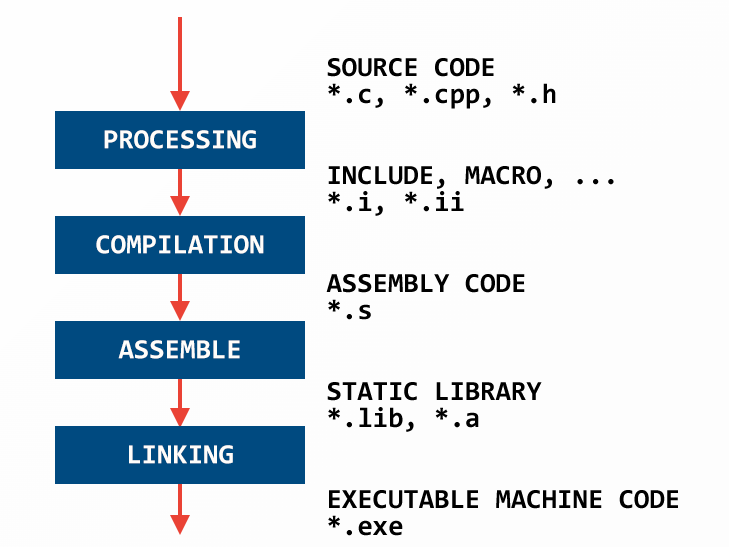

# ADVANCE C/C++ ALGORITHM (HalaAcademy)

## BÀI 1: COMPILER VÀ CÁC CHỈ THỊ TIỀN XỬ LÝ

### 1. QUÁ TRÌNH BIÊN DỊCH (COMPILER)

**Compiler** là một quá trình máy tính chuyển đổi mã nguồn được viết bằng một ngôn ngữ lập trình (như C, C++,...) thành mã máy (machine code) mà máy tính có thể hiểu và thực thi.

**BAO GỒM 4 BƯỚC:**

#### Bước 1: Tiền xử lý (Preprocessing)
+ Copy tất cả nội dung trong các file được #include
+ Thay thế các Macro # 
+ Lược bỏ chú thích  //, /**/
Sau quá trình này file `source.c -> source.i`
Ta có 2 file `main.c` và `hello.c`
 

Sau khi thực hiện lệnh `gcc -E hello.c -o hello.i` và `gcc -E main.c -o main.i`
Ta đc 2 file `main.i` và `hello.i`
  

#### Bước 2: Compilation
+ Trình biên dịch chuyển mã nguồn thành mã assembly.
Sau quá trình này file `source.i -> source.s`

Thực hiện lệnh `gcc -S main.i -o main.s` và `gcc -S hello.i -o hello.s`
  

#### Bước 3: Assemble
+ Trình biên dịch chuyển từ mã máy thành mã nhị phân.
Sau quá trình này file `source.s -> source.o`

Thực hiện lệnh `gcc -c main.s -o main.o` và `gcc -c hello.s -o hello.o`
  

#### Bước 4: Linking
+ Liên kết các module và các thư viện liên kết thành file thực thi.
+ Hợp các file nguồn, file thư viện thành 1 file thực thi duy nhất `source.exe`
  
Thực hiện lệnh `gcc main.o hello.o -o main` để hợp nhất thành 1 file thực thi `main.exe` 
  
+ Chạy file thực thi 

        PS C:\Users\Huy Le\Documents\HALAacedemy\Code\CodeC_Advance\B1> gcc main.o hello.o -o main
        PS C:\Users\Huy Le\Documents\HALAacedemy\Code\CodeC_Advance\B1> ./main
        hello everyone
        function 1

### 2. CÁC CHỈ THỊ TIỀN XỬ LÝ

#### - Chỉ thị bao hàm tệp (#include)
Chỉ thị `#include` cho phép gộp file khác vào file chúng ta đang viết
ví dụ:
 

Sau quá trình tiền xử lý:
 

Ta có thể thấy toàn bộ nội dung file `hello.h` đã được copy vào `main.c`
#### - Chỉ thị định nghĩa cho tên (#define macro)  

**Marco** là một cách để định nghĩa lại một giá trị hay một chuỗi các lệnh nhằm tránh lặp lại mã và có thể làm cho chương trình dễ bảo trì hơn. 
**Marco** được định nghĩa bằng chỉ thị `#define` 

`#define PI 3.14`   
`#define MAX(a, b) ((a) > (b) ? (a) : (b))`     

**Variadic Macro** (macro biến số) là loại macro trong C có thể nhận một số lượng tham số không xác định. Chúng cho phép định nghĩa các macro có thể xử lý nhiều tham số hơn so với macro thông thường.
Cú pháp: 
#define DISPLAY(...)   ____VA_ARGS____
Trong đó:
+ `...`: Đại diện cho các tham số biến đổi
+ __VA_ARGS__: Đại diện cho các tham số biến đổi trong phần thân của macro.

Ví dụ:
Bài toán tính tổng của 1 dãy số:

Ở file main.c

    #include "stdio.h"
    #define tong(...)  \
    int array[] = {__VA_ARGS__, -1};\         // __VA_ARGS__ = ...
    int i = 0;                      \
    int sum = 0;                    \
    while(array[i] != -1)           \
    {                               \
        sum = sum + array[i];       \
        i ++;                       \
    }                               \
    printf("tong = %d\n", sum);

    int main()
    {
        tong(4,5,7,9,11);                   // __VA_ARGS__ = 4,5,7,9,11
        
        return 0;
    }

Ở file main.i

    int main()
    {
        int array[] = {4,5,7,9,11, -1};      // __VA_ARGS__ đã được thay vào 
        int i = 0;
        int sum = 0;
        while(array[i] != -1)
        { 
        sum = sum + array[i]; 
        i ++; 
        } 
        printf("tong = %d\n", sum);;

        return 0;
    }

Một số ứng dụng của **Variadic Macro**: 

+ **Log messages**: Viết các macro để ghi lại thông báo log với định dạng tùy ý.
`#define LOG(format, ...) fprintf(stderr, format, __VA_ARGS__)`
+ **Debugging**: Thêm thông tin như tên hàm, file nguồn, hoặc dòng số vào thông báo debug.
`#define DEBUG(format, ...) fprintf(stderr, "[DEBUG] %s:%d: " format, __FILE__, __LINE__, __VA_ARGS__)`
## BÀI 2: STDARG - ASSERT
### 1.Thư viện #include <stdarg.h> 
Variadic functions (hàm biến số tham số) là các hàm trong C có thể nhận một số lượng tham số không xác định. Điều này khác với các hàm thông thường, nơi số lượng tham số được xác định tại thời điểm khai báo hàm
Cách sử dụng:
+ Khai báo hàm: `int sum(int count, ...)` cho phép hàm nhận một số lượng tham số biến đổi sau tham số cố định count.
+ Macro `va_list`: Được sử dụng để khai báo một biến có thể truy cập các tham số nhập vào.
+ Macro `va_start`: Được sử dụng để khởi tạo danh sách các tham số biến đổi. Nó nhận vào hai tham số: danh sách args và tên của label làm mốc. Ví dụ ở đây là label `count`
+ Macro `va_arg`: Được sử dụng để truy xuất từng tham số biến đổi từ danh sách args. Mỗi lần gọi va_arg, bạn nhận được giá trị của tham số tiếp theo với kiểu dữ liệu được chỉ định ví dụ ở đây là `int`.
+ Macro `va_end`: Được sử dụng để kết thúc việc truy cập danh sách các tham số biến đổi.

Một số ứng dụng của **Variadic Function**: 
**Tạo các hàm xử lý nhiều tham số** 

Bài tập: tính tổng của 1 dãy số.

    #define tong(...)   sum(__VA_ARGS__, 0)    /*giá trị 0 là dấu hiệu kết thúc*/
    int sum(int count,...) 
    {
        va_list va;      /*khai báo 1 biến để truy cập tham số nhập vào*/
        int sum = count; 

        va_start(va, count);   /*khởi tạo danh sách tham số bắt đầu từ label count*/
        int value;

        while ((value = va_arg(va, int)) != 0)  /*lấy giá trị và kiểm tra */
        {
            sum += value;
        }

        va_end(va);                            /*kết thúc*/

        return sum;
        
    }

    int main()
    {
        printf("Tong: %d\n", tong(6, 1,4, 5,9,6,4));

        return 0;
    }

Kết quả: 
`Tong: 35`

+**Xây dựng hàm để xử lý dữ liệu** 

Bài tập: viết hàm xử lý 2 hay nhiều cảm biến:

    #include <stdio.h>
    #include <stdarg.h>

    typedef enum{
        TEMPERATURE_SENSOR,
        PRESSURE_SENSOR
    }SensorType;

    void processSensorData(SensorType type, ...)
    {
        va_list args;               /*khai báo 1 biến để truy cập tham số nhập vào*/
        va_start(args, type);      // xác định lable để lấy dữ liệu 
        switch (type)
        {
            case TEMPERATURE_SENSOR:
            {
                int numArgs = va_arg(args, int);            // lấy dữ liệu 1 ép kiểu int 
                int sensorId = va_arg(args, int);           // lấy dữ liệu 2 ép kiểu int
                float temperature = va_arg(args, double);   // lấy dữ liệu 3 ép kiểu double 

                
                printf("Temperature Sensor ID: %d, Reading: %.2f degrees\n", sensorId, temperature);
                if(numArgs > 2)
                {
                    // xử lí thêm tham số nếu có 
                    char* additionalInfo = va_arg(args, char*);  // lấy dữ liệu 4 ép kiểu char* 
                    printf("Additional Info:%s\n", additionalInfo); 
                }
                break;
            }
            case PRESSURE_SENSOR: 
            {
                int numArgs = va_arg(args, int);
                int sensorId = va_arg(args, int);
                int pressure = va_arg(args, int);
                printf("Pressure Sensor ID: %d, Reading: %d Pa\n", sensorId, pressure);
                if(numArgs > 2)
                {
                    // Xử lý thêm tham số nếu có
                    char* unit = va_arg(args, char*);
                    printf("Unit: %s\n", unit);
                }
                break;
            }     

            default:
                break;
        }

        va_end(args);                
    }

    int main()
    {
        processSensorData(TEMPERATURE_SENSOR, 3, 1, 36.5, "Room Temperature");
        processSensorData(PRESSURE_SENSOR, 3, 2, 101325);    
        return 0;
    }
Kết quả:

    Temperature Sensor ID: 1, Reading: 36.50 degrees
    Additional Info:Room Temperature
    Pressure Sensor ID: 2, Reading: 101325 Pa
    Unit: Room Temperature

## BÀI 3: CON TRỎ (POINTER)

### 1. Con trỏ
**Con trỏ** là một biến mà trong đó giá trị của nó là địa chỉ của một biến khác.
**Cách sử dụng con trỏ:**
- *Khai báo con trỏ*: `type *pointer_name;`
- *Gán địa chỉ cho con trỏ*: sử dụng toán tử `&` ví dụ:
    `int a = 10;`
    `int *ptr = &a;  // khai báo và gán giá trị địa chỉ biến a cho con trỏ ptr`
- *Truy cập giá trị thông qua con trỏ*: sử dụng toán tử `*` ví dụ: 
    `*ptr = 20 // thay đổi giá trị của địa chỉ mà ptr đang trỏ tới = 20`    

Ví dụ: 

    int a = 10;
    int *ptr = &a;  // khai báo và gán giá trị địa chỉ biến a cho con trỏ ptr

    printf("dia chi cua bien a: %p\n", &a);             // in ra địa chỉ biến a
    printf("gia tri cua con tro ptr: %p\n", ptr);       // in ra giá trị của ptr

    printf("gia tri cua bien a: %d\n", a);              // in ra giá trị của biến a
    printf("gia tri tai dia chi ptr tro den: %d\n", *ptr);     // in ra giá trị tại địa chỉ ptr trở đến
Kết quả in ra Terminal: 

    dia chi cua bien a:      000000048FFFFDD4
    gia tri cua con tro ptr: 000000048FFFFDD4
    gia tri cua bien a: 10
    gia tri tai dia chi ptr tro den: 10

### 2. Con trỏ hàm
**Con trỏ hàm** được dùng để lưu trữ địa chỉ của một hàm. Điều này cho phép gọi hàm thông qua con trỏ, điều này hữu ích trong các trường hợp như truyền hàm làm đối số cho các hàm khác. 
**Cách sử dụng con trỏ hàm:**
- *Khai báo con trỏ hàm*: `return_type (*pointer_name)(parameter_types);`
  ví dụ: `int (*pFunc)(int, int);`
- Gán địa chỉ hàm cho con trỏ:
  
  ví dụ: 

        int add(int a, int b) 
        {
            return a + b;
        }
        pFunc = add;
- Gọi hàm thông qua con trỏ:
    `int result = pFunc(5, 3); // Kết quả là 8`

ví dụ:

    #include <stdio.h>
    int add(int a, int b)
    {
        return a + b;
    }

    int main()
    {
        int (*ptr)(int,int);

        ptr = add;
        int sum = ptr(3,5);
        printf("sum = %d\n", sum);     // in ra giá trị tại địa chỉ ptr trở đến

        return 0;
    }

kết quả:
 `sum = 8`

### 3. Con trỏ hằng 

### 4. Hằng con trỏ 

